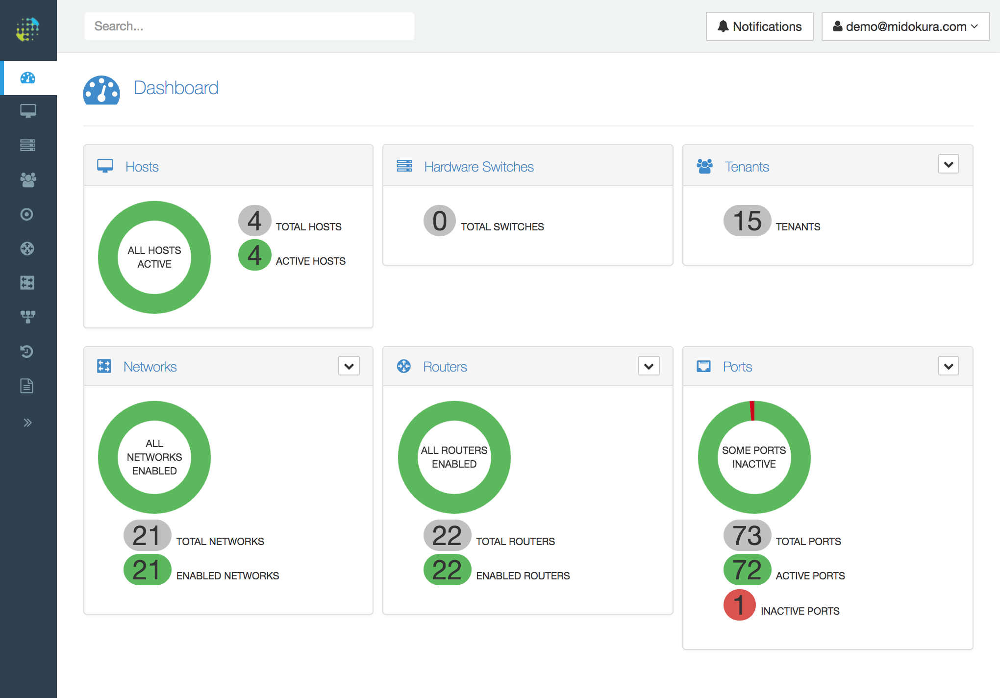
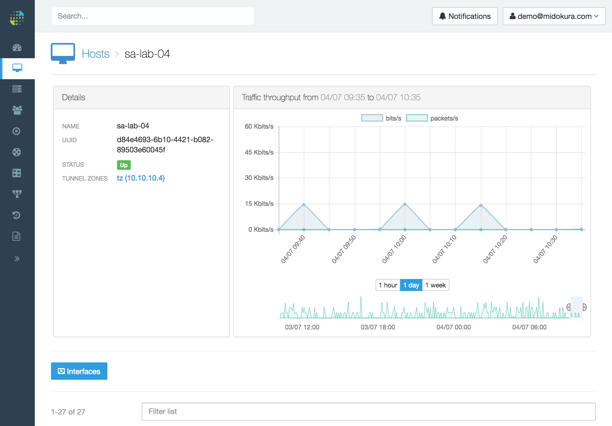

# Documentation

## Table of Contents
<generated automatically>

## What is MidoInsights?

> Currently, MidoInsights is a technical preview or beta release, designed for
OpenStack clouds using <a href="https://www.midonet.org/">MidoNet</a> as a
software-defined networking (SDN) controller.

MidoInsights is a [Midokura](https://www.midokura.com/) service for the
monitoring and remote management of the networking components of an
[OpenStack](https://www.openstack.org/) cloud. It offers visibility into
the status and performance of the OpenStack networking components both at
the physical and virtual layers. It enables cloud administrators to maintain
an overall health check of their cloud, setup triggers and alerts for detecting
problems, navigate through the collected networking data with increasing
levels of granularity, and use a comprehensive set of troubleshooting tools.

### Using MidoInsights

To monitor and manage your OpenStack cloud using MidoInsights you must create
a MidoInsights account and connect your on-premise OpenStack cloud also named
as _site_ to MidoInsights. Once this connection is established, some of your
site data will be uploaded to the MidoInsights service in order to provide you
the monitoring features, such as navigating through your virtual networking
devices or analyzing networking traffic.

The type, volume and retention of the data uploaded to the MidoInsights service
depends on the features available to your account. In addition, you can control
which features are active and whether particular types of data are replicated
to the MidoInsights service.

Once you have configured your site with MidoInsights, you can login to
the MidoInsights management portal. The following image illustrates the
MidoInsights dashboard, showing the current status of your cloud, such as
the number of active hypervisor hosts, physical and virtual networking devices.



The cloud operator can obtain more detailed information, such as the status
of individual devices, the status of their connections, network traffic volumes
and individual traffic flows.



### MidoInsights Architecture

At the core of MidoInsights there is a central repository that stores the
data uploaded from customer OpenStack sites. The data is formatted, filtered and
indexed according to the features where it is used, improving the scalability of
the service with large customer clouds.

The customer sites maintain a single persistent and secure connection between
one or more gateway machines located at the customer premise and a set of
secure endpoints of the MidoInsights service. This enables a bidirectional
exchange of information between the site and the MidoInsights service, where
customer data such as physical and virtual network topology, network traffic
and flow measurements, logging and alerting is replicated to MidoInsights,
whereas customer configuration, commands and features customizations are
downloaded to the customer site.

In addition to maintaining copies of live site data, the MidoInsights repository
stores historical information. The data retention interval depends on the
particular feature being used, customer storage quota and configuration.

### MidoInsights Security

MidoInsights has been built from the ground up with the goal of protecting and
securing your data. At Midokura, we understand that customer data privacy and
confidentiality is paramount, and therefore MidoInsights includes several layers
of protection in order to safeguard the data that is being replicated from
the customer site.

The connection between your site and MidoInsights uses a transport-layer
security protocol (TLS1.2) employing ciphering and hashing algorithms with keys
of at least 256 bits. The authentication uses a public-key certificate
auto-generated at your site, and the certificate's private key never
leaves the customer premise. This enables you to renew your site's
authentication certificate in the event that it gets compromised.

Sensitive customer profile data is encrypted in order to decrease the
likelihood of being compromised during an attack. MidoInsights does not
store any customer passwords, only the public key of your site certificates.
Site data from your OpenStack clouds is annotated and indexed with the customer
site identifier from the moment it is received at the MidoInsights service until
deletion.

Data retention depends on your MidoInsights plan. In plans using a storage
quota, time-series data such as traffic metering and flow history is purged
once the quota has been reached. The deletion of old data may be done in
bulk increments but always ensuring that you benefit of the full use of your
plan storage. Other types of data uploaded from your cloud will persist for
the lifetime of your site. Midokura may store this data for up to 30 days
after a site has been deleted. User and customer account information will be
stored for up to 90 days or up to the maximum permitted by regulations,
whichever is shorter.

MidoInsights data is stored on servers owned by Midokura located in secure data
centers. Access to these servers, both physical and remote, is limited to
Midokura personnel.

## Getting Started

To get started with MidoInsights you can create a free trial account. Intended
for the evaluation of the MidoInsights service, this account type will give
you unlimited access to the following features: monitoring dashboard,
navigation through your physical and virtual devices, network traffic metering,
flow history and reporting. The trial account has a usage quota of 20 GB of
storage and 1 site.

### Sign Up for MidoInsights

Go to the [sign up](https://beta.insights.midokura.com/signup/trial) page and
follow the directions to create a free trial account. The following image
illustrates the form used during the signup process.


Your MidoInsights account is identified by the email address you use during
sign up. You must validate this email address before your account is activated.

### Sign In to MidoInsights

Go to the [sign in](https://beta.insights.midokura.com/login) page and enter
the email address and password of your account to sign in.


Once you sign in, the **Sign In** button is replaced with an **Account**
button displaying your user name. This provides a contextual menu that
enables you to navigate through your MidoInsights account.


* The **Insights manager** option opens the cloud manager for your OpenStack
site.

* The **Manage account** option opens the account management page, where you
can update your personal data, change your password and manage your sites.

* The **Sign out** option closes the current session.

### Connect Your Site

To connect an OpenStack cloud to MidoInsights you must install the
MidoInsights on-premise software. Currently, MidoInsights supports only
cloud installations using the [MidoNet](https://www.midonet.org/) open-source
SDN controller. Therefore, the on-premise software is provided in the form
of a MidoNet plugin that seamlessly integrates with your current installation.
This _MidoNet Insights Plugin_ is available in the public MidoNet repository.

The MidoNet Insights Plugin supports OpenStack clouds with MidoNet 5.4.1 or
newer, and it has the same environment requirements as the version of MidoNet
on which it is installed.

1. Add the MidoNet repository to the package manager of your operating
system. Before proceeding, consult the documentation of your distribution. You
can skip this step if the MidoNet repository is already configured.

On Ubuntu, use the following command to add the MidoNet repository.

```
apt-add-repository 'deb http://builds.midonet.org/current stable main'
```

On RedHat Enterprise Linux, use the following command to add the MidoNet
repository.

```
echo <<EOF > /etc/yum.repos.d/midonet.repo
[midonet]
name=MidoNet
baseurl=http://builds.midonet.org/current/stable/el7/
enabled=1
gpgcheck=1
gpgkey=https://builds.midonet.org/midorepo.key
EOF
```

On SUSE Linux Enterprise, use the following command to add the MidoNet
repository.

```
zypper addrepo -f http://builds.midonet.org/current/stable/sles12/ midonet
```

2. Install the MidoNet Insights Plugin on any machine running the MidoNet
Cluster. This machine must have network access to the following Internet
address: `gw.beta.insights.midokura.com:443`. The machine you select will
act as the MidoInsights Gateway, connecting your on-premise cloud with the
MidoInsights service. For increased security, you may install a dedicated
machine for this purpose, on which can disable non-essential MidoNet Cluster
services. You must restart the MidoNet Cluster for the installation to take
effect.

On Ubuntu, use the following command to install the MidoNet Insights Plugin.

```
apt-get install midonet-insights-plugin
service midonet-cluster restart
```

On RedHat Enterprise Linux, use the following command to install the MidoNet
Insights Plugin.

```
yum install midonet-insights-plugin
service midonet-cluster restart
```

On SUSE Linux Enterprise, use the following command to install the MidoNet
Insights Plugin.

```
zypper install midonet-insights-plugin
service midonet-cluster restart
```

You can verify whether the MidoNet Insights Plugin has been installed correctly
by consulting the MidoNet Cluster logs after restart. If successful, the log
should contain the following messages at the `INFO` log level.

```
Starting cluster minion: insights
Starting Insights Cluster service...
```

3. Upon installation, the MidoNet Insights Plugin will create a pubic-private
key pair that is used for authenticating your connection to the MidoInsights
service and encrypting the data exchanged with your site. To allow your site
to connect to the MidoInsights service, you must add the fingerprint of your
public key to your MidoInsights account. To facilitate this step, the
MidoNet Insights Plugin includes a tool that enables you to retrieve this
fingerprint in one easy step.

On your MidoNet Cluster machine with the MidoNet Insights Plugin installed, use
the following command to show the fingerprint for your site public key.

```
mn-insights show
```

4. In the **Account Management** page of your MidoInsights account, add your
site fingerprint to the list of site fingerprints as illustrated by the image
below.


Once added, your site should automatically establish a secure connection to
the MidoInsights service and begin replicating data from your cloud.

Use the MidoNet Cluster log to troubleshoot whether a secure connection has been
established between your site and the MidoInsights service. If the connection
has been successful, the following message should appear in the log at the
`INFO` log level.

```
Gateway client connected to gw.beta.insights.midokura.com:443
```

### Insights Manager

Select the **Insights manager** option in the MidoInsights menu to open the
Insights Manager for your site. If your site has successfully connected to the
MidoInsights service, data replication should start automatically and the
manager dashboard will already contain information about your cloud.

## How To

### Use Traffic Metering

MidoInsights provides network traffic metering for both physical and virtual
devices. When the feature is enabled, this data is shown automatically when
navigating through the devices in your site.

For example, the following image illustrates the traffic metering collected
for a virtual network, displayed in the large chart, as well as for each
virtual port on that network, displayed in the smaller charts.


### Use Flow History

In the **Insights Manager**, select the **Flow History** page, as illustrated in
the following image.


This will show all traffic flows setup by the SDN controller of your cloud
matching the specified criteria. You have the option of choosing a particular
time period, and adding custom traffic filters. MidoInsights supports the
following flow history filters.

* Time period.
* Source and destination hardware (MAC) addresses.
* Source and destination network (IP) addresses.
* Source and destination transport (TCP or UDP) ports.
* Transport protocol.
* Ethertype.
* Hypervisor host.
* Source and destination tenants.
* Whether the traffic was allowed or dropped.

#### Use Flow History with MidoNet 5.4

In MidoNet 5.4, the replication of flow history data from your site to the
MidoInsights service is not automatic. Instead, it requires the following
configuration steps to be performed on your premise.

1. Enable the flow history feature on the MidoNet Agents. Use the `mn-conf`
tool for this purpose. You can enable flow history on all hypervisor hosts
or only on select, as desired. Consult the [MidoNet Operations Guide](
https://docs.midonet.org/docs/latest-en/operations-guide/content/index.html)
for further information. Go to the [MidoNet Configuration Documentation](
https://docs.midonet.org/docs/latest-en/operations-guide/content/advanced_configuration_and_concepts.html)
for more information on the MidoNet configuration and the usage of the
`mn-conf` tool.

To enable the flow history feature at the MidoNet agents, set the following
configuration option. The default value of this option is `false` and it
requires the restart of the MidoNet Agent to take effect.

```
agent.flow_history.enabled : true
```

2. Configure the MidoNet agents to report their flow history data to the
MidoNet Insights Plugin. MidoNet agents will detect the presence of a running
plugin in a MidoNet installation using service discovery. For this purpose, you
must set the appropriate service name to the following configuration option.
The default value of the option is `clio` and it requires a restart of the
MidoNet Agent to take effect.

```
agent.flow_history.endpoint_service : insights
```

3. If the machine running the MidoNet Insights Plugin has more than one
network interface, you must select the interface IP address that is reachable
from the MidoNet agents. Set the following configuration option to the IP
address that is reachable from the MidoNet agents. You must restart the
MidoNet Cluster in order for the change to take effect.

```
insights_cloud.recorder.host=<IP-ADDRESS>
```

### Use Reports

In the **Insights Manager**, select the **Report** page, as illustrated in the
following image.


Currently, MidoInsights provides several built-in reports. You can change the
report type from the drop-down box at the top of the reports page.

* **North-south traffic per tenant** summarizes the network traffic volume
exchanged between a tenant network and its corresponding external network. The
report will include the top volume tenants, and you have the option of
selecting a reporting time period.

* **Total traffic per tenant** summarizes the total traffic volume generated by
a tenant. This includes both north-south and east-west traffic, that is
traffic exchanged within the tenant network. The report will include the top
volume tenants, and you have the option of selecting a reporting time period.

* **Total traffic per network** summarizes the total traffic volume per network.
You have the option of filtering per a specific tenant, and selecting a
reporting time period.

### Manage Your Account

Select the **Manage account** option in the MidoInsights menu, and select the
**Details** tab to navigate to the account management page. Here, you can edit
the personal information of your account such as your name, change your password
or delete your user account.


### Manage Your Sites

Select the **Manage account** option in the MidoInsights menu, and select the
**Site fingerprints** tab to navigate to the site fingerprints page. Here, you
can add the fingerprint for a new site, up to the limit permitted by your
customer account plan.

To add a new fingerprint, enter the fingerprint in the **New site fingerprint**
edit box, and click on the **Add** button.

To delete an existing fingerprint, click the **Delete** button corresponding to
the fingerprint you want to delete. You will be asked to confirm the deletion
of the site fingerprint, since deletion will make the data for that site
unavailable.

Adding or deleting a fingerprint will take effect immediately. In addition,
deleting the fingerprint for a site will mark all data for that site for
deletion. Data marked for deletion will be retained for a brief period, as
specified in the _Data Retention_ section.

## MidoInsights Releases

### Versions

| Date | Version | Description |
|---|---|---|
| 2017/06/30 | 0.1.0 | Beta release |

### Release Notes

#### MidoInsights 0.1.0

* Public beta release.
* Plugin for MidoNet v5.4.1 and newer.
* Trial plan.
* Dashboard and cloud navigation.
* Traffic metering.
* Flow history.
* Reporting.

